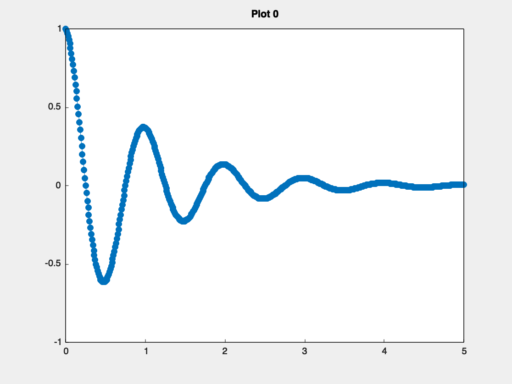
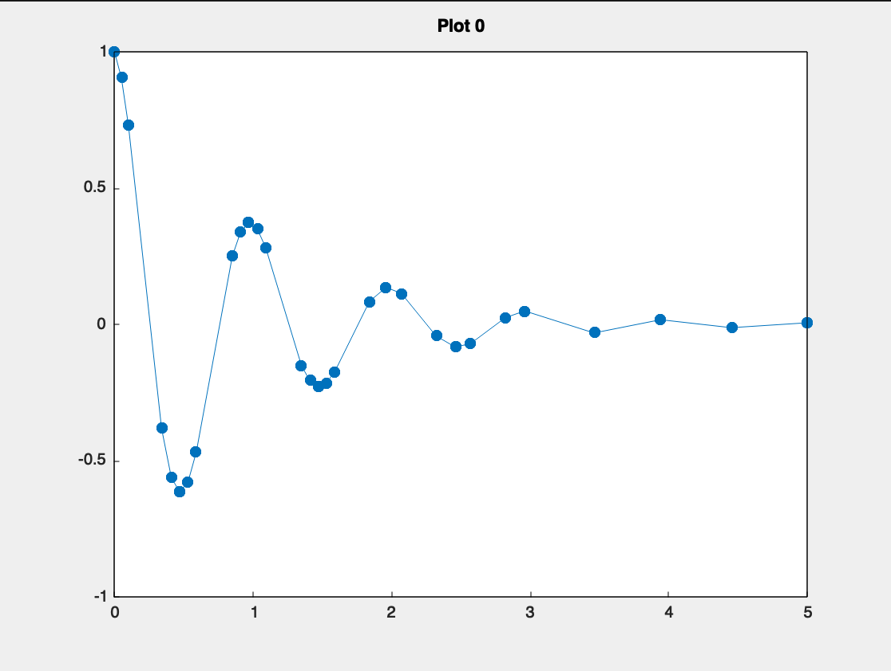

# Douglas-Peucker Algorithm

Reduced a path from 501 point to just 142 points. About 72% reduction.

# Build and Run
`$ cmake -S . -B build`  
`$ cmake --build build`  
`$ ./build/src/douglas-peucker`  